# ch01 课程导学

## 课程的目标

### 课程的目标

借助项目实战，传递PyTorch构建深度学习的技术体系，帮助同学达成算法工程师的入门要求。

### 结合实例的概念

课程中会讲解上百个相关概念，我们把这些概念糅合在具体的实践课程中，让概念更容易理解，防止枯燥的解释。

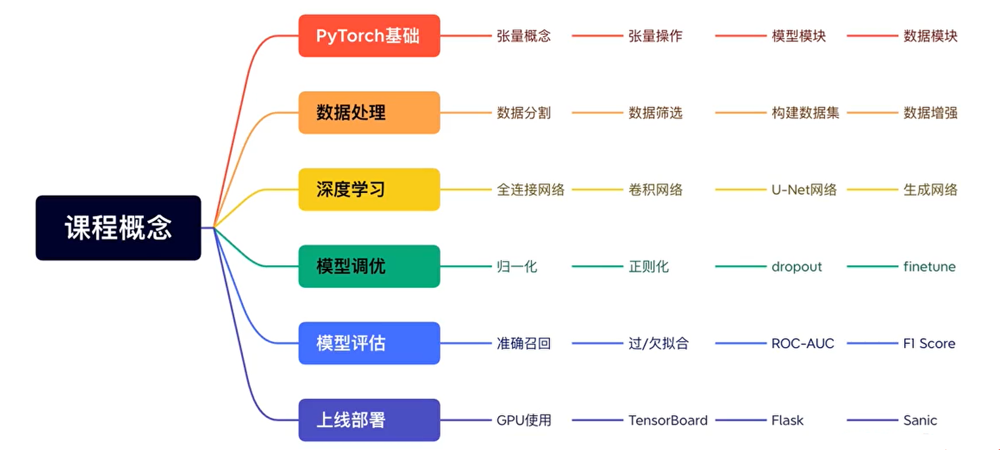

### 充分的代码讲解

课程中涉及全部代码超过1w行，基本上每个部分都会配合代码的编写，尤其是最后的实战项目提供全部的代码，让你不再局限于理论。

### 丰富的实践内容

课程中共涉及大小5个实践项目，8个数据集，5种数据读取方式，借助丰富的实践内容带领大家逐步学习内容。

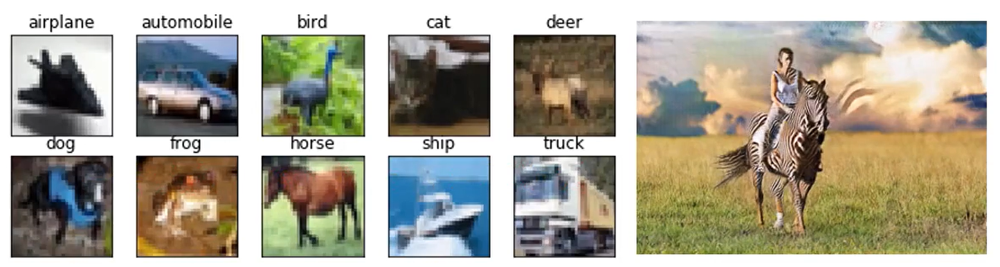

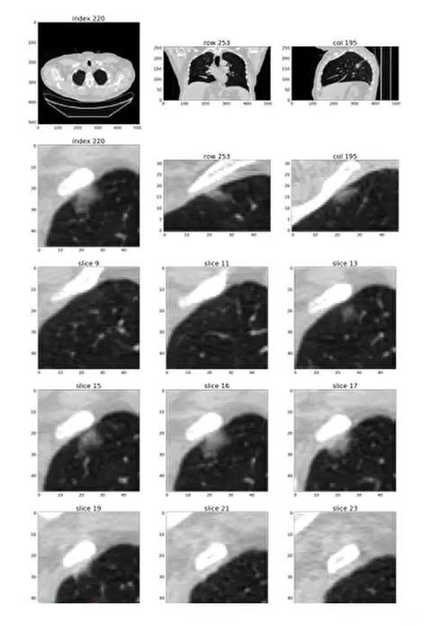

### 延伸的论文阅读

围绕课程中逐步展开的要点、模型及优化方法，将相关论文地址放在课程中，支持同学扩展阅读。

## 课程内容安排

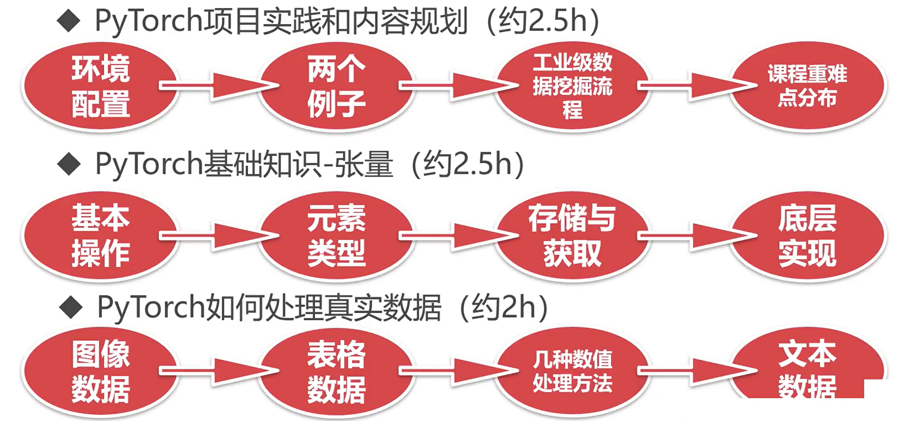

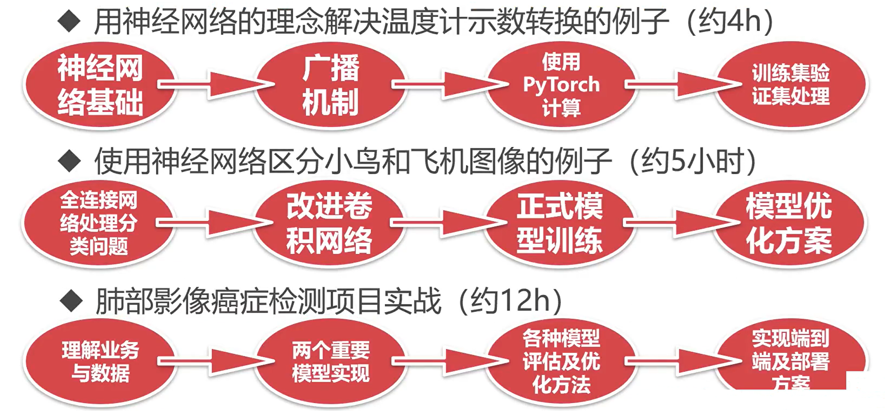

## 学习准备

- 知识储备
    - Python代码基础
    - 高等数学、线性代数知识
- 软硬件环境
    - 有一台使用顺手的电脑
    - 最好有GPU
    - Windows、MacOS、Linux
- 心理准备
    - 欲速则不达
    - 我不会，但我可以学

## 深度学习如何影响生活

### 人工智能与深度学习

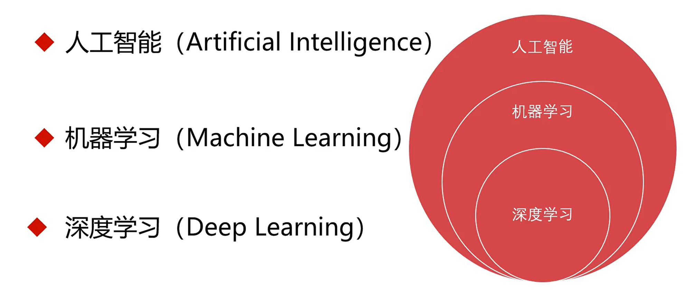

### 深度学习的发展历程

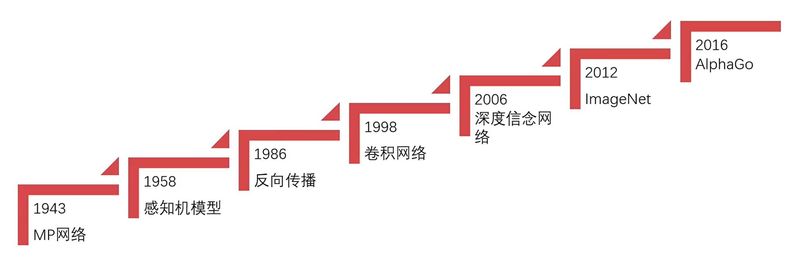

《深度学习：智能时代的核心驱动力量》

作者：特伦斯$\cdot$谢诺夫斯基

神经网络的先驱，早在1986年，特伦斯就与杰弗里$\cdot$辛顿共同发明了玻尔兹曼机。

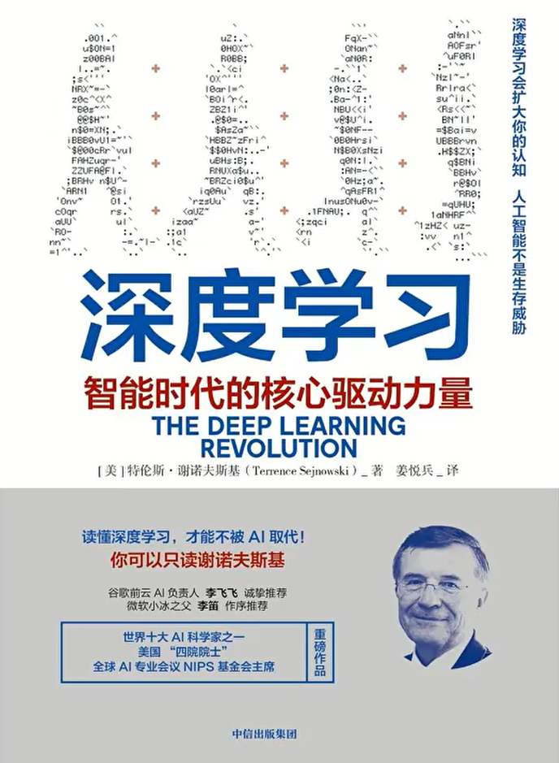

### 深度学习的应用

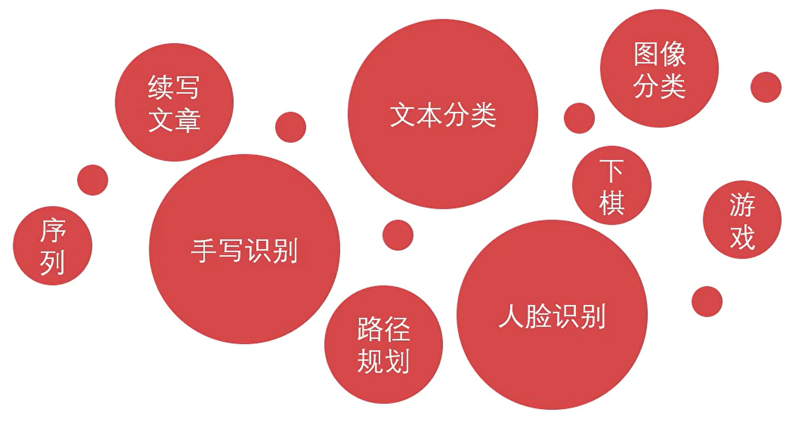

### 深度学习在生活中

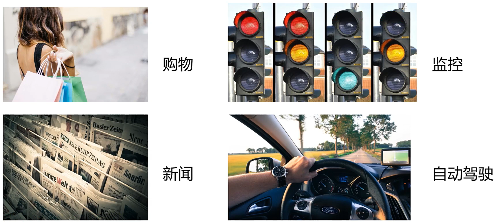

## 常见深度学习框架对比

### 什么是PyTorch
- FaceBook（Meta）开发
- 基于Python编写
- 机器学习库
- 2017年推出

### 常见深度学习框架

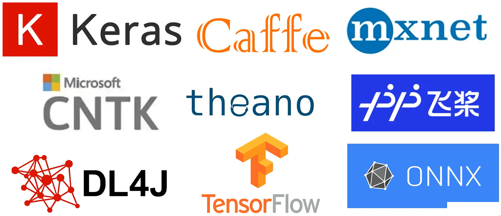

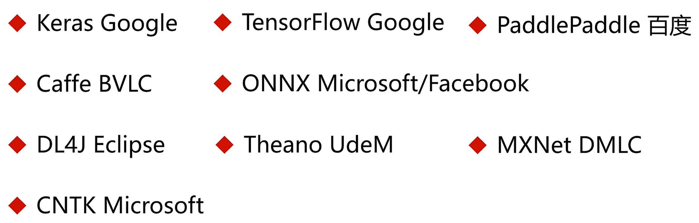

### 市场层面的对比

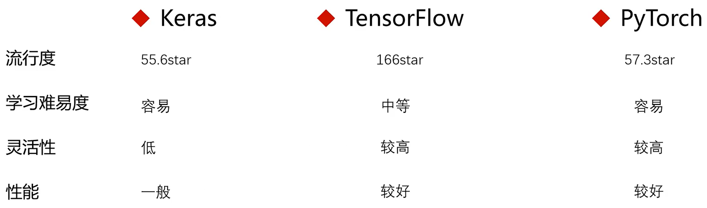

### 使用层面的对比

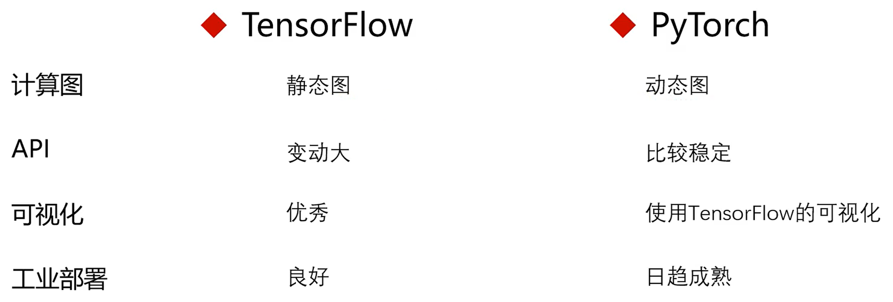

