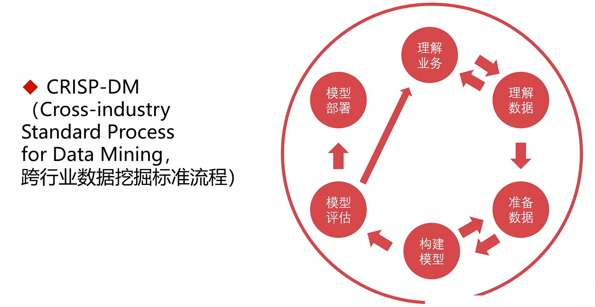
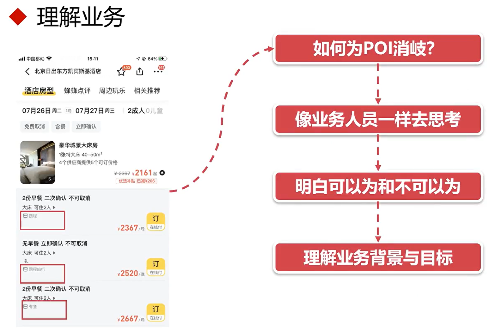
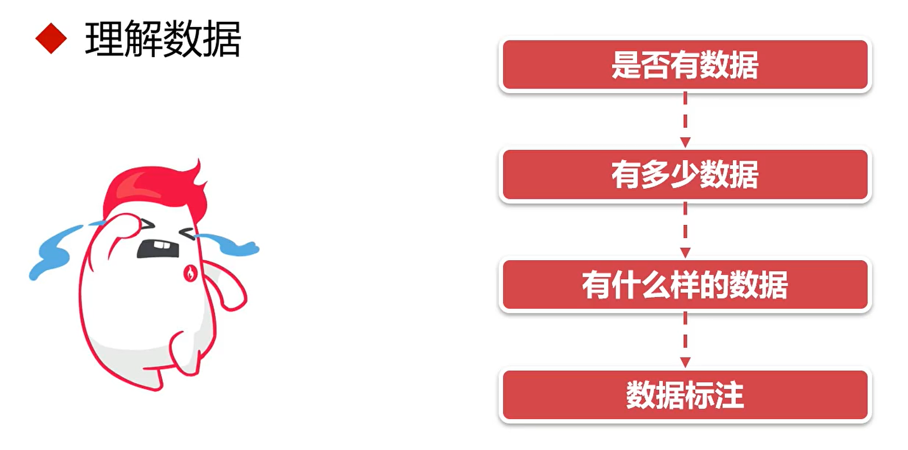
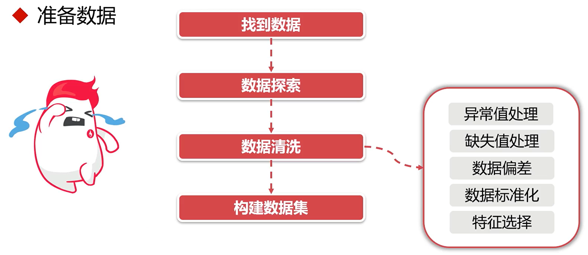
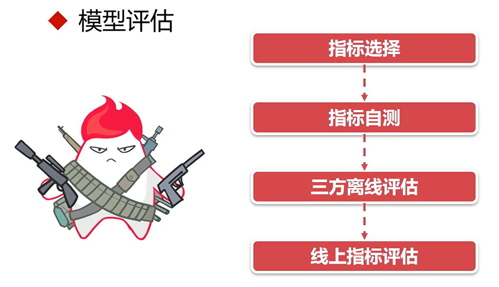
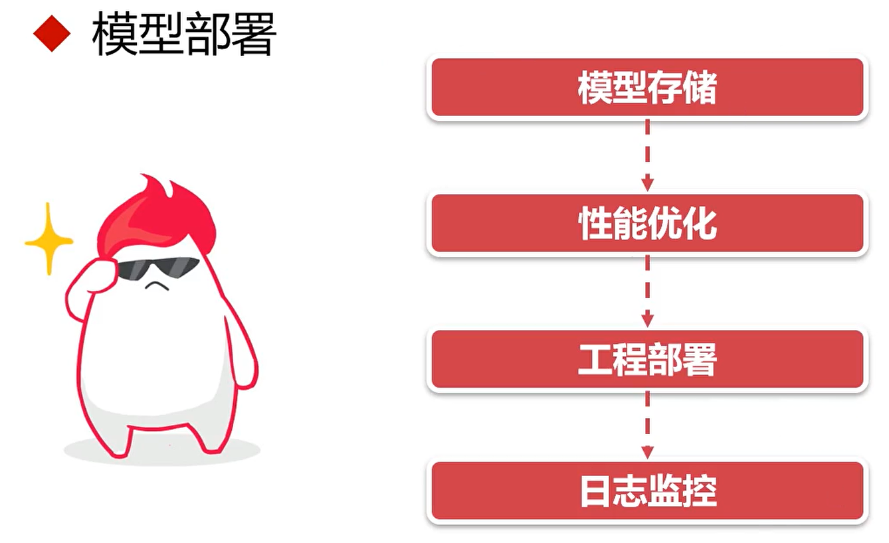
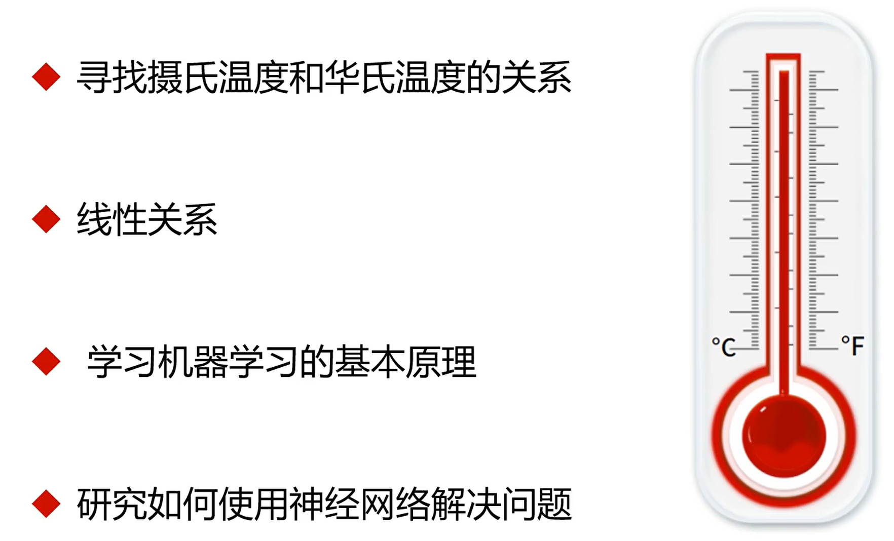
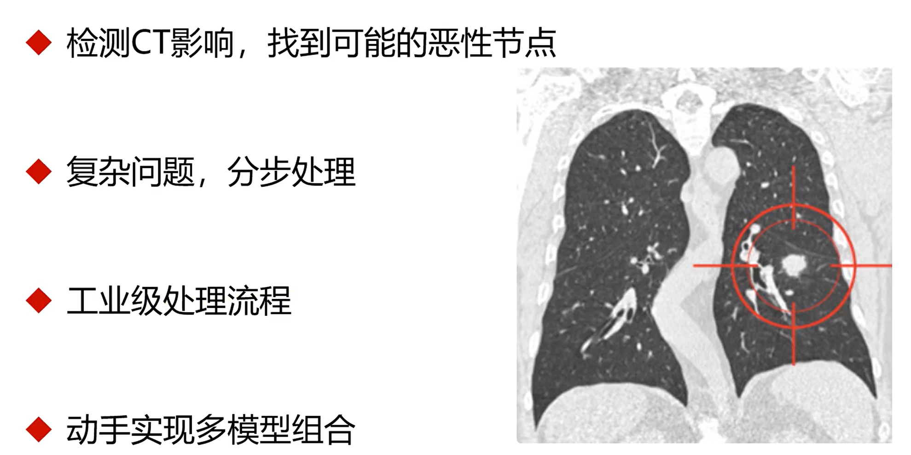

# ch03 PyTorch项目热身实践

## 工业级数据挖掘流程

### 两种算法工程师

### 跨行业数据挖掘标准流程

### 理解业务

### 理解数据

### 准备数据

### 模型构建

### 模型评估

### 模型部署

## 课程重难点技能分布

- 张量的基础知识——PyTorch中的张量特性
- 如何处理真实数据——图像、表格、文本数据
- 模型训练的基础知识——基本概念及代码
- 如何使用PyTorch实现模型训练功能——代码实现
- 图像分类——实现、优化、评估——方案及代码
- 大型项目实战——思维、框架、设计、实现、优化、评估
- 工程部署及课程回顾

## 课程实战项目简介

### 温度计示数转换

### 区分小鸟和飞机

### 肺部癌症检测

