# ch04 PyTorch基础知识必备：张量

## 什么是张量（Tensor）

- 张量就是一个<span style="color: red; font-weight: bold;">多维数组</span>
- “张量”一词最初由威廉$\cdot$罗恩$\cdot$哈密顿在1846年引入，但他把这个词用于指代现在称为模的对象。该词的现代意义是沃尔德马尔$\cdot$福格特在1899年开始使用的。

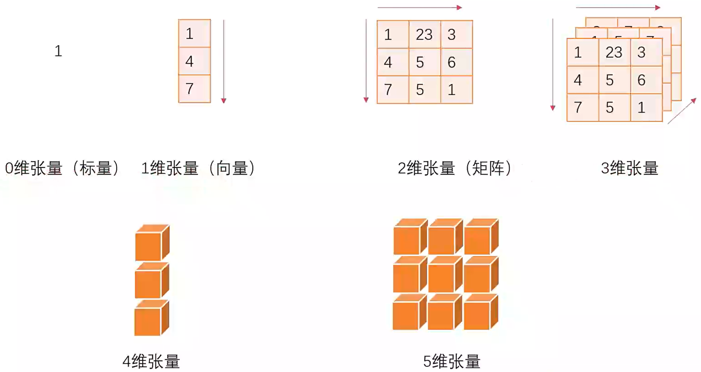

### 从列表到张量

- 一个普通的Python列表

```python
a = [1.0, 2.0, 3.0]
a[0] # 按位置索引访问列表元素
```

- 产生一个PyTorch张量

```python
import torch
a = torch.ones(3)
a # 输出一个张量结果
# tensor([1., 1., 1.])
```

- 一些简单的操作

```python
a[1] ### 按位置索引访问元素
# out: tensor(1.)

float(a[1]) # 强行转为浮点数
# out: 1.0 # 可以看出这个时候输出的就不带tensor限定了

a[2] = 2.0 # 改变其中的元素
a # 输出看看
# out: tensor([1., 1., 2.]) # 这里可以看到最后一个元素变成了2，这些操作跟列表操作基本没啥区别
```

## PyTorch张量的获取与存储

### 直接从原生数据创建

```python
import torch

a = 1
t1 = torch.tensor(a)
t1
# out: tensor(1)

b = [1, 2, 3]
t2 = torch.tensor(b)
t2
# out: tensor([1, 2, 3])
```

### 从NumPy创建

<p style="color: deeppink; font-weight: bold;">会共享内存！</p>

```python
import torch

import numpy as np

arr = np.array([[1, 2, 3], [4, 5, 6]])
t = torch.from_numpy(arr)
t
# out: 
# tensor([[1, 2, 3], 
#         [4, 5, 6]], dtype=torch.int32)

arr[0, 0] = 100
arr
# out:
# array([[100,  2,  3],
#        [4, 5, 6]])

t
# out:
# tensor([[100, 2, 3],
#         [4, 5, 6]], dtype=torch.int32)
```

### 确定数值创建

torch.zeros()

功能：依size创建全0张量

size：张量的形状，如(3, 3)、(3, 224, 224)

out：输出的张量，将torch.zero()生成的张量复制给out对应的输入变量

layout：内存中的布局形式，默认为strided，矩阵为稀疏矩阵时可使用sparse_coo

device：所在设备，gpu/cpu

requires_grad：是否需要梯度

```python
a = torch.zeros(3, 3)
a
# out: 
# tensor([[0., 0., 0.], 
#         [0., 0., 0.],
#         [0., 0., 0.]])
```

torch.zeros_like() # 根据输入的张量生成同形状的张量

torch.ones() # 生成全1张量

torch.ones_like()

torch.full() # 根据输入的数值x，生成全x的张量

torch.full_like()

### 其他创建方法

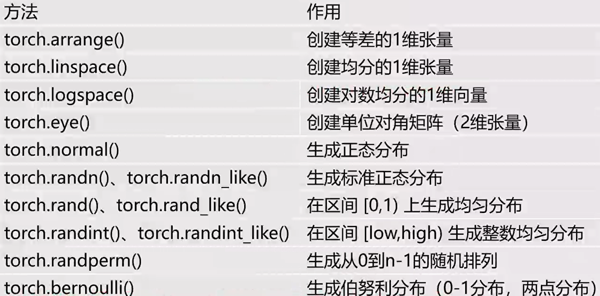

### 原生方法保存和读取张量

```python
# 存储tensor 方法1
torch.save(points, 'D:/pytorchProject/data/3/ourpoints.t')
# 存储tensor 方法2
with open('D:/pytorchProject/data/3/ourpoints.t', 'wb') as f:
    torch.save(points, f)
# 读取tensor 方法1
points = torch.load('D:/pytorchProject/data/3/ourpoints.t')
# 读取tensor 方法2
with open('D:/pytorchProject/data/3/ourpoints.t', 'rb') as f:
    points = torch.load(f)
```

### 把tensor保存成通用形式

```python
# 注意这个库需要单独安装
import h5py

# 存储数据，这里输入了一个key'coords'，我理解这个存储是key-value格式的，这个key应该是可以自定义的？
points = torch.ones(3, 3)
f = h5py.File('D:/pytorchProject/data/3/ourpoints.hdf5', 'w')
dset = f.create_dataset('abc', data=points.numpy())
f.close()

# 读取数据
f = h5py.File('D:/pytorchProject/data/3/ourpoints.hdf5', 'r')
dset = f['abc']

# 把数据恢复到tensor中
last_points = torch.from_numpy(dset[:])
f.close()
```

## PyTorch张量的基本操作

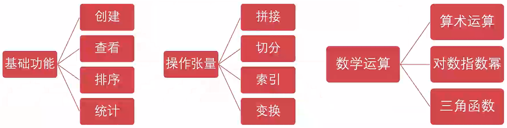

### 张量的拼接

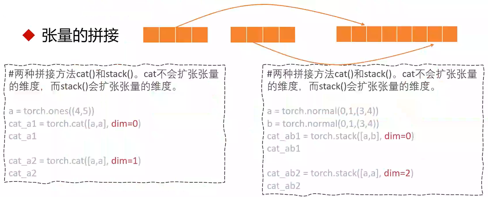

```python
# 两种拼接方法cat()和stack()。cat()不会扩张张量的维度，而stack()会扩张张量的维度。
import torch

a = torch.ones((4, 5))
cat_a1 = torch.cat([a, a], dim=0)
cat_a1

cat_a2 = torch.cat([a, a], dim=1)
cat_a2

a = torch.normal(0, 1, (3, 4))
b = torch.normal(0, 1, (3, 4))
cat_ab1 = torch.stack([a, b], dim=0)
cat_ab1

cat_ab2 = torch.stack([a, a], dim=2)
cat_ab2
```

### 张量的切分

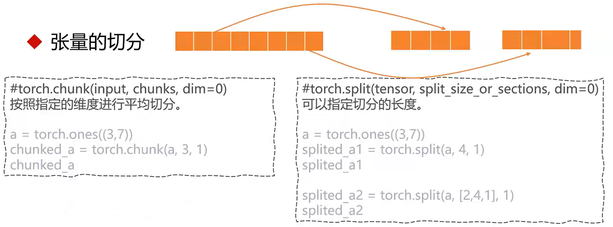

```python
# torch.chunk(input, chunks, dim=0) 按照指定的维度进行平均切分

a = torch.ones((3, 7))
chunked_a = torch.chunk(a, 3, 1)
chunked_a
```

```python
# torch.split(input, split_size_or_sections, dim=0) 可以指定切分的长度
import torch

a = torch.ones((3, 7))
splited_a1 = torch.split(a, 4, 1)
splited_a1

splited_a2 = torch.split(a, [2, 4, 1], 1)
splited_a2
```

### 张量的索引

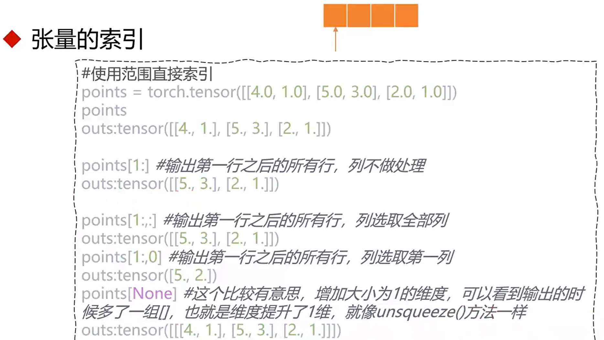

```python
# 使用范围直接索引
import torch

points = torch.tensor([[4.0, 1.0], [5.0, 3.0], [2.0, 1.0]])
points
# outs: tensor([[4., 1.], [5., 3.], [2., 1.])

points[1:] # 输出第一行之后的所有行，列不做处理
# outs: tensor([[5., 3.], [2., 1.]])

points[1:,:] # 输出第一行之后的所有行，列选取全部列
# outs: tensor([[5., 3.], [2., 1.]])
points[1:,0] # 输出第一行之后的所有行，列选取第一列
# outs: tensor([5., 2.])
points[None] # 这个比较有意思，增加大小为1的维度，可以看到输出的时候多了一组[]，也就是维度提升了1维，就像unsqueeze()方法一样
# outs: tensor([[[4., 1.], [5., 3.], [2., 1.]]])
```

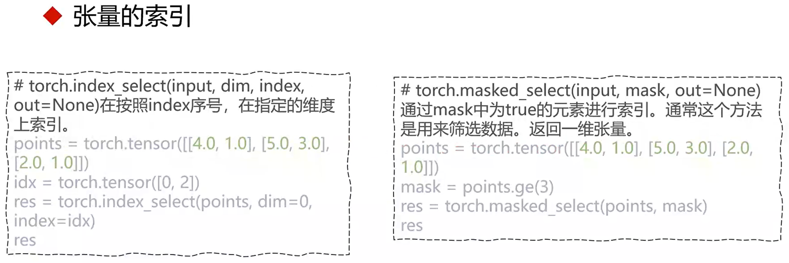

```python
# torch.index_select(input, dim, index, out=None)在按照index序号，在指定的维度上索引。
points = torch.tensor([[4.0, 1.0], [5.0, 3.0], [2.0, 1.0]])
idx = torch.tensor([0, 2])
res = torch.index_select(points, dim=0, index=idx)
res
```

````python
# torch.masked_select(input, mask, out=None)通过mask中为true的元素进行索引。通过这个方法是用来筛选数据。返回一维张量。
points = torch.tensor([[4.0, 1.0], [5.0, 3.0], [2.0, 1.0]])
mask = points.ge(3)
res = torch.masked_select(points, mask=mask)
res
````

### 张量的变换

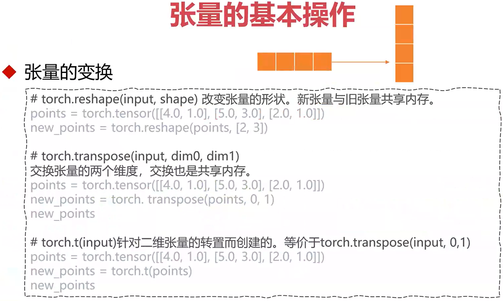

```python
# torch.reshape(input, shape) 改变张量的形状。新张量与旧张量共享内存。
points = torch.tensor([[4.0, 1.0], [5.0, 3.0], [2.0, 1.0]])
new_points = torch.reshape(points, [2, 3])

# torch.transpose(input, dim0, dim1) 交换张量的两个维度，交换也是共享内存。
points = torch.tensor([[4.0, 1.0], [5.0, 3.0], [2.0, 1.0]])
new_points = torch.transpose(points, 0, 1)
new_points

# torch.t(input) 针对二维张量的转置而创建的，等价于torch.transpose(input, 0, 1)
points = torch.tensor([[4.0, 1.0], [5.0, 3.0], [2.0, 1.0]])
new_points = torch.t(points)
new_points
```

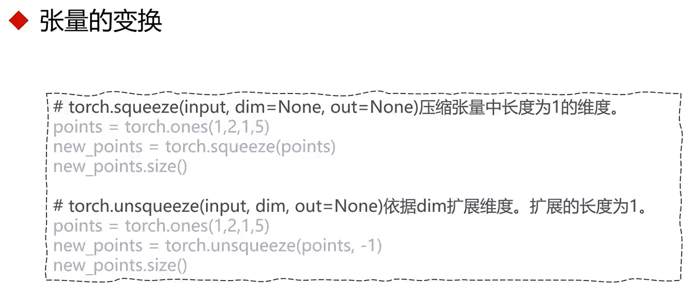

```python
# torch.squeeze(input, dim=None, out=None) 压缩张量中长度为1的维度。
points = torch.ones(1, 2, 1, 5)
new_points = torch.squeeze(points)
new_points.size()

# torch.unsqueeze(input, dim, out=None) 依据dim扩展维度。扩展的长度为1。
points = torch.ones(1, 2, 1, 5)
new_points = torch.unsqueeze(points, -1)
new_points.size()
```

### 数学运算

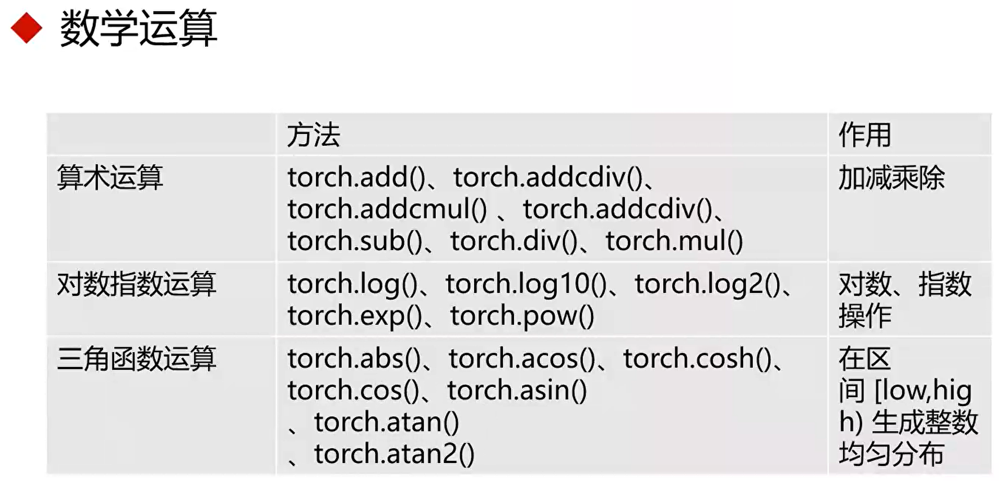

## PyTorch张量的元素类型

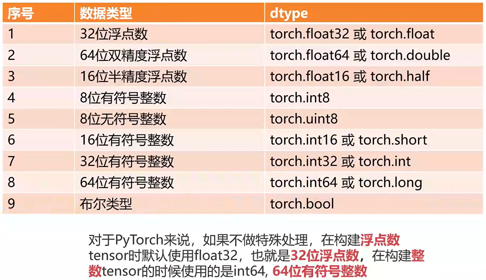

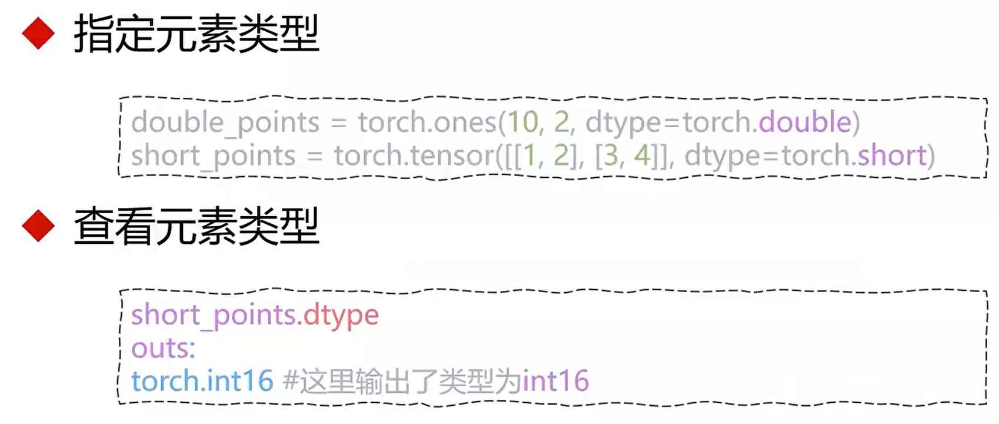

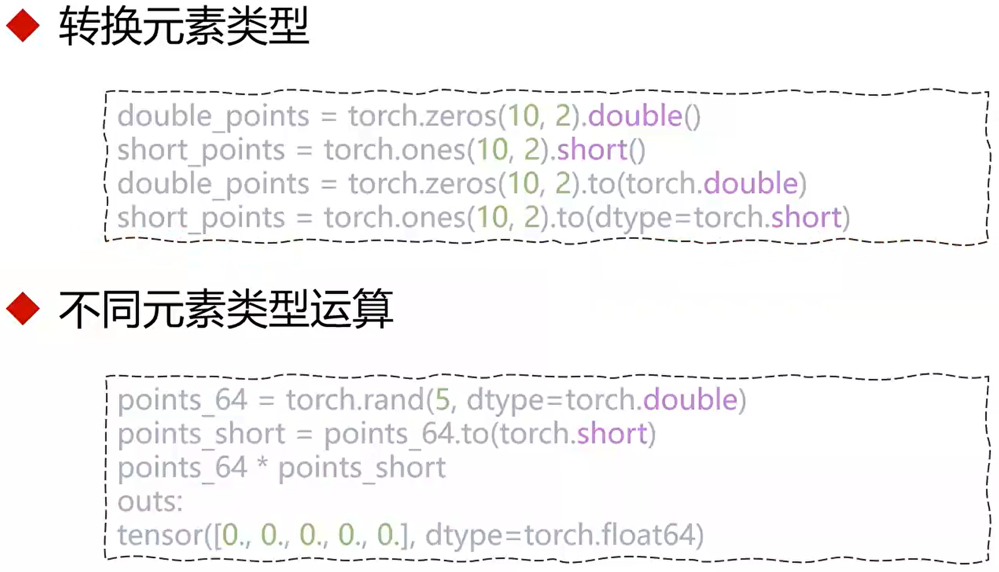

## PyTorch张量的命名

### 考虑现在有表示一幅图像的tensor

```python
img_t = torch.randn(3, 5, 5)

weights = torch.tensor([0.2126, 0.7152, 0.0722])
```

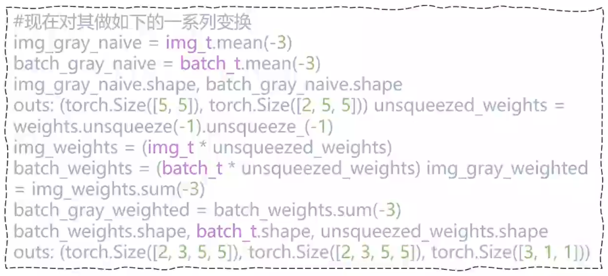

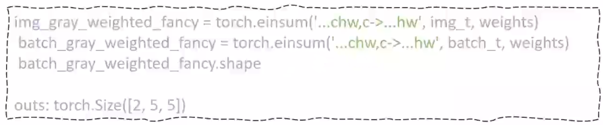

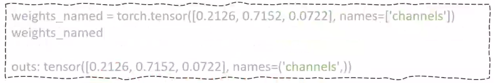

### 更多命名操作

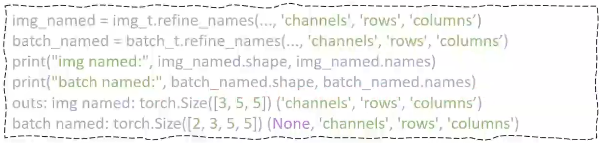

### 运算需要相同的维度名称

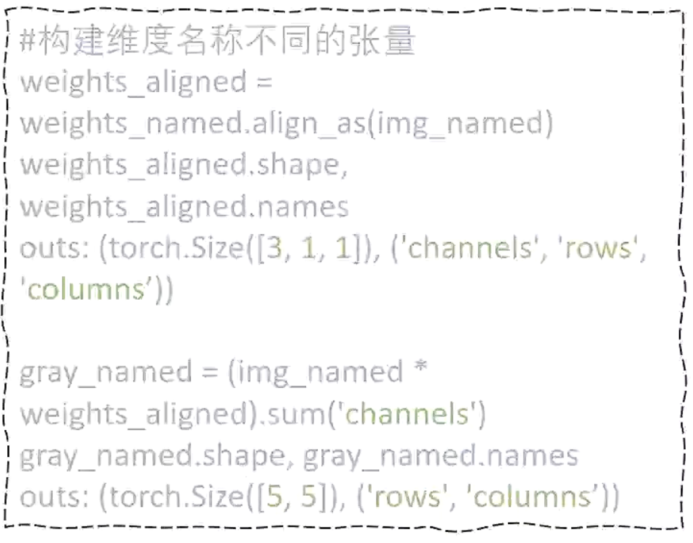

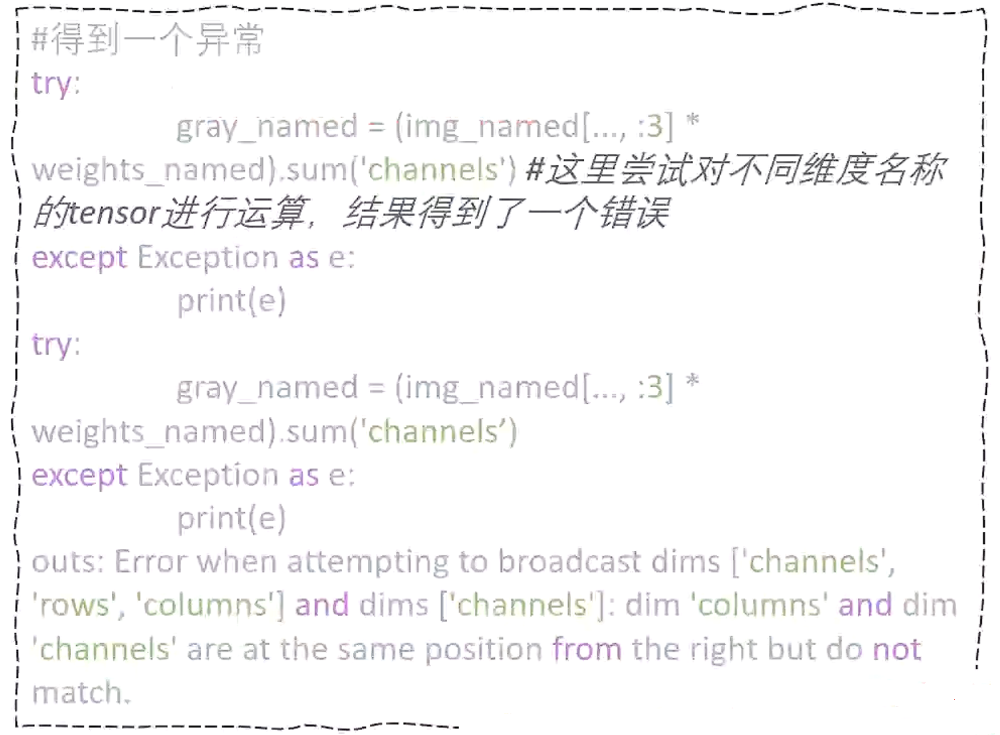

### 使用rename操作修改维度名称

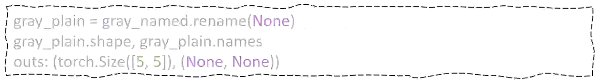

> Tips：关于命名这个操作看起来挺美好，主要是适配人阅读习惯，但是对齐它也是很困难的事情，所以这个特性或许并不怎么好用。


