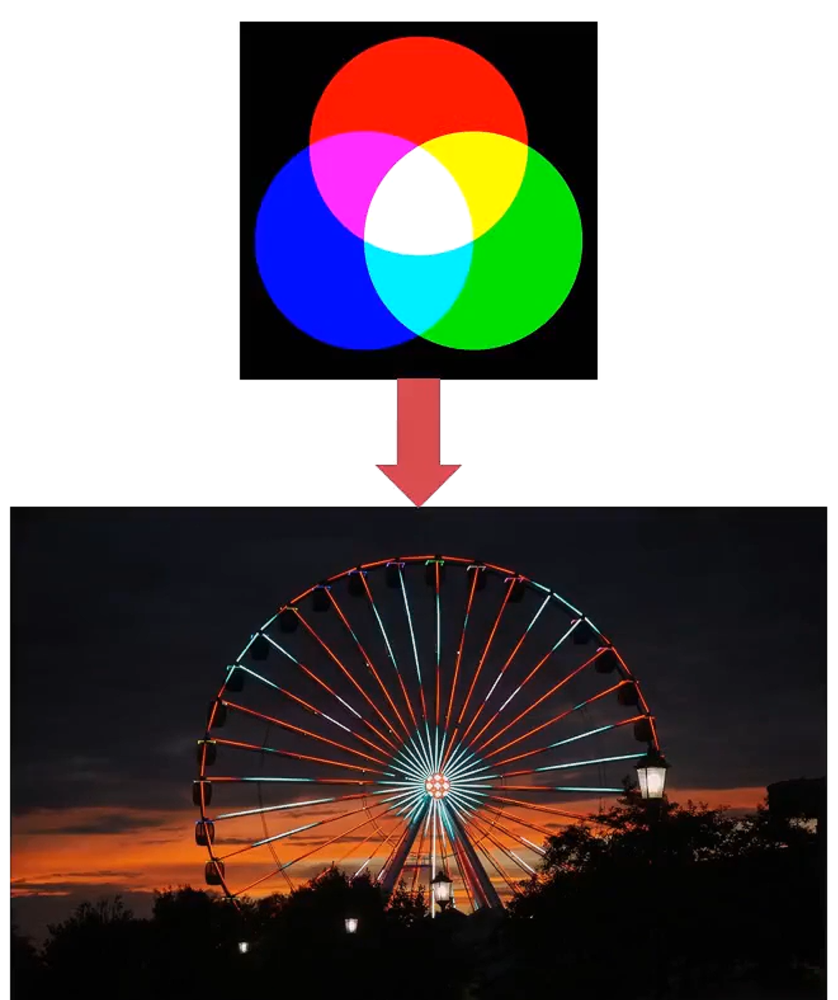
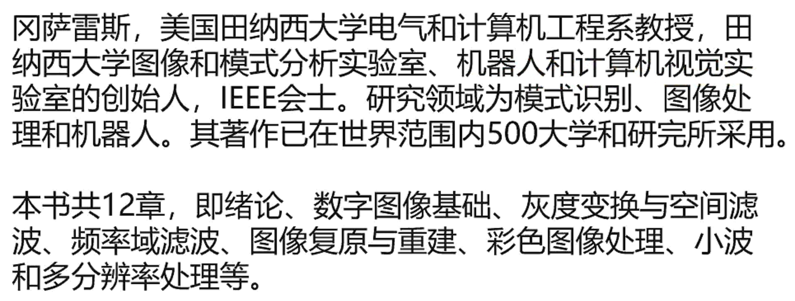
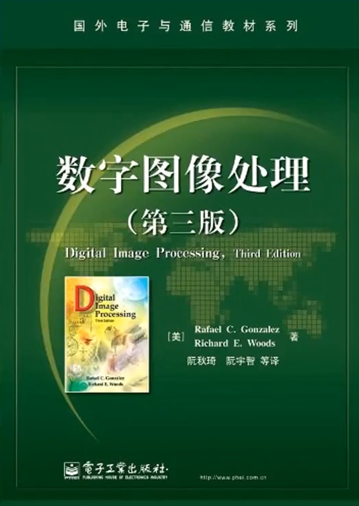
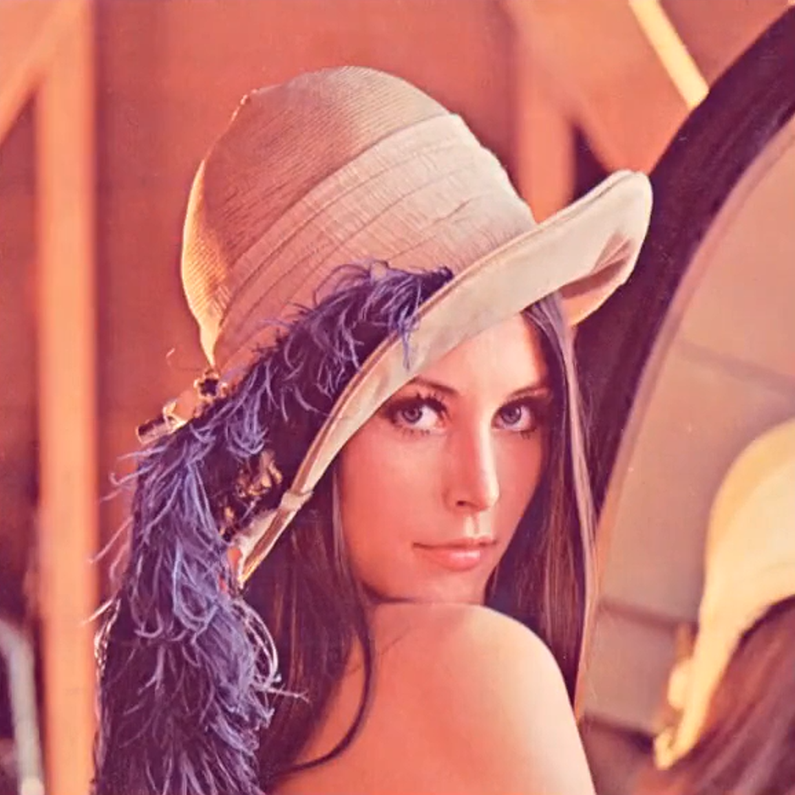

# ch05 PyTorch如何处理真实数据

## 图像——二维图像加载

### 图像算法在互联网中的应用


### 图像的基本构成——RGB通道

RGB是我们接触最多的颜色空间，由三个通道表示一幅图像，分别为红色（R）、绿色（G）和蓝色（B）。所有颜色都由这三种颜色组合而成。

RGB颜色空间是图像处理中最基本、最常用、面向硬件的颜色空间，比较容易理解。



### 图像处理的经典作品





### 单图的加载

这图的各个频段的能量都很丰富：既有低频（光滑的皮肤），也有高频（帽子的羽毛），很适合来验证各种算法。



```python
# 图像读取
import imageio

img_arr = imageio.imread('D:/pytorchProject/data/4/lena.jpg')
img_arr.shape
# outs: (512, 512, 3)
# 转换为tensor
import torch
img = torch.from_numpy(img_arr)
out = img.permute(2, 0, 1)
out.shape
# outs: torch.Size([3, 512, 512])
```